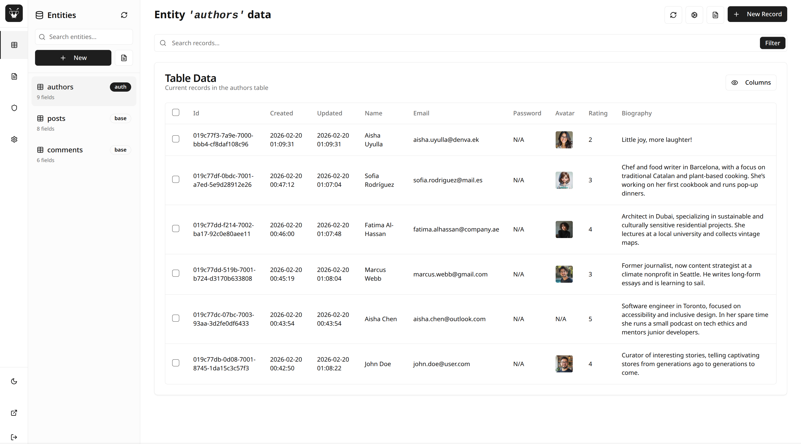

# MantisBase Admin Dashboard

A modern, web-based admin dashboard for managing your MantisBase backend. This dashboard provides an intuitive interface for managing entities, admins, settings, and more.



## 📋 Table of Contents

- [About](#about)
- [Getting Started](#getting-started)
- [Development](#development)
- [Building for Production](#building-for-production)
- [Integration with MantisBase](#integration-with-mantisbase)
- [Features](#features)
- [Links](#links)

## 🎯 About

MantisBase Admin Dashboard is the official administrative interface for [MantisBase](https://github.com/allankoechke/mantisbase), a lightweight Backend-as-a-Service (BaaS) written in C++. This dashboard allows you to:

- Manage database entities and their schemas
- Configure access rules and permissions
- Manage admin users
- View application logs
- Configure application settings
- And much more!

## 🚀 Getting Started

### Prerequisites

Before you begin, ensure you have the following installed:

- **Node.js** (version 20 or higher)
- **npm** (comes with Node.js)
- A running **MantisBase** server instance

### Installation

1. **Clone the repository**
   ```bash
   git clone https://github.com/allankoechke/mantisbase-admin.git
   cd mantis-admin
   ```

2. **Install dependencies**
   ```bash
   npm install
   ```

3. **Start the development server**
   ```bash
   npm run dev
   ```

4. **Open your browser**
   Navigate to `http://localhost:3000` (or the port shown in your terminal)

### First Login

1. If this is your first time setting up MantisBase, you'll need to create an admin account:
   - Navigate to `/mb/setup?token=YOUR_SETUP_TOKEN`
   - Enter your email and password
   - You'll be redirected to the login page

2. Log in with your admin credentials at `/mb/login`

## 💻 Development

### Available Scripts

- `npm run dev` - Start the development server with hot-reload
- `npm run build` - Build the application for production
- `npm run lint` - Run ESLint to check code quality
- `npm start` - Start the production server (requires build first)

### Development Mode

In development mode, the dashboard will:
- Connect to `http://localhost:7070` by default (or the port specified in `MANTIS_PORT` environment variable)
- Enable hot module replacement for faster development
- Show detailed error messages

### Environment Variables

You can customize the development setup using environment variables:

- `MANTIS_PORT` - Port for the MantisBase API (default: 7070)
- `NEXT_PUBLIC_BASE_PATH` - Base path for the application (default: `/mb` in production)

## 🏗️ Building for Production

To build the dashboard for production:

```bash
npm run build
```

The built static files will be in the `out/` directory. These files can be served by any static file server.

### Static Export

The dashboard is configured for static export, making it easy to deploy to:
- GitHub Pages
- Netlify
- Vercel
- Any static hosting service

## 🔗 Integration with MantisBase

### The `mb-admins` Branch

This repository includes a special branch called `mb-admins` that is automatically integrated with the main [MantisBase project](https://github.com/allankoechke/mantisbase) via CMake.

**Important Notes:**

- The `mb-admins` branch contains the built static files of the admin dashboard
- This branch is **automatically updated** on every release
- The MantisBase CMake build system uses this branch to include the admin interface
- When you build MantisBase, it automatically fetches the latest admin dashboard from this branch

### How It Works

1. When a new version is released (tagged with `v*`), a GitHub Action automatically:
   - Builds the admin dashboard
   - Updates the `mb-admins` branch with the latest static files
   - Creates a GitHub release with downloadable assets

2. The MantisBase CMake configuration:
   - Clones or updates the `mb-admins` branch during build
   - Includes the admin dashboard files in the MantisBase build
   - Serves the admin interface at `/mb/*` when MantisBase is running

This integration ensures that MantisBase always includes the latest stable version of the admin dashboard without requiring manual updates.

## ✨ Features

### Entity Management
- Create, read, update, and delete database entities
- Configure entity schemas with custom fields
- Set up access rules (list, get, add, update, delete)
- View and manage entity records

### Admin Management
- Create and manage admin user accounts
- Change admin passwords
- View admin activity

### Settings
- Configure application settings
- Manage file upload limits
- Configure session timeouts
- Enable/disable features

### Logs
- View application logs
- Filter and search logs
- Monitor system activity

### Modern UI
- Dark/light theme support
- Responsive design
- Intuitive navigation
- Real-time updates

## 🔗 Links

- **Main MantisBase Project**: [https://github.com/allankoechke/mantisbase](https://github.com/allankoechke/mantisbase)
- **Documentation**: [https://docs.mantisbase.com](https://docs.mantisbase.com)
- **This Repository**: [https://github.com/allankoechke/mantisbase-admin](https://github.com/allankoechke/mantisbase-admin)

## 📝 Notes

> **Note**: This project is still in active development. Some features may be incomplete or subject to change.

## 🤝 Contributing

Contributions are welcome! Please feel free to submit a Pull Request.

## 📄 License

This project is part of the MantisBase ecosystem. Please refer to the main MantisBase repository for license information.

---

**Made with ❤️ for the MantisBase community**
