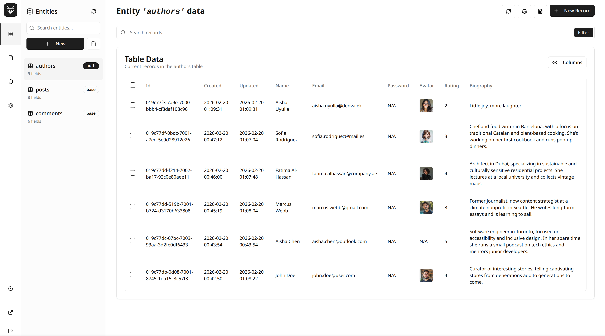

# MantisBase Admin Dashboard

A modern, web-based admin dashboard for managing your [MantisBase](https://github.com/allankoechke/mantisbase) backend. Manage entities, schemas, auth, OAuth, API keys, admins, settings, and logs from a single UI.



## Table of Contents

- [About](#about)
- [Getting Started](#getting-started)
- [Development](#development)
- [Authentication](#authentication)
- [Building for Production](#building-for-production)
- [Integration with MantisBase](#integration-with-mantisbase)
- [Features](#features)
- [API Reference](#api-reference)
- [Project Structure](#project-structure)
- [Links](#links)

## About

MantisBase Admin is the official administrative interface for MantisBase, a lightweight Backend-as-a-Service (BaaS) written in C++. It talks to the MantisBase REST API at `/api/v1/` and is designed to be served alongside the backend (typically under `/mb/`).

## Getting Started

### Prerequisites

- **Node.js** 20 or higher
- **npm**
- A running **MantisBase** server (default port `7070`)

### Installation

1. **Clone the repository**

   ```bash
   git clone https://github.com/allankoechke/mantisbase-admin.git
   cd mantisbase-admin
   ```

2. **Install dependencies**

   ```bash
   npm install
   ```

3. **Start the development server**

   ```bash
   npm run dev
   ```

4. **Open the app**

   Navigate to `http://localhost:3000` (or the port shown in the terminal).

   In development, API requests to `/api/*` are proxied to the MantisBase backend (see [Development](#development)).

### First login

1. **Initial setup** (first run of MantisBase only):

   - Go to `/mb/setup?token=YOUR_SETUP_TOKEN`
   - Create the first admin account
   - You will be redirected to login

2. **Sign in** at `/mb/login` with your admin credentials.

## Development

### Scripts

| Command | Description |
|---------|-------------|
| `npm run dev` | Development server with hot reload |
| `npm run build` | Production static export to `out/` |
| `npm run lint` | Run ESLint |
| `npm start` | Production server (requires build) |

### Dev API proxy

During `npm run dev`, Next.js rewrites `/api/:path*` to the MantisBase backend so the admin UI and API share the same origin. That allows **HttpOnly session cookies** to work without CORS issues.

Default target: `http://127.0.0.1:7070` (override with `MANTIS_PORT` or `MANTIS_PROXY_URL`).

When `NEXT_PUBLIC_MANTIS_BASE_URL` is set, the client calls that URL directly instead of using the dev proxy (useful for remote backends).

### Environment variables

| Variable | Description |
|----------|-------------|
| `MANTIS_PORT` | MantisBase API port when using the dev proxy (default: `7070`) |
| `MANTIS_PROXY_URL` | Full backend URL for the dev proxy (overrides `MANTIS_PORT`) |
| `NEXT_PUBLIC_BASE_PATH` | App base path. Default: `/mb` in production, empty in dev. Set to `""` for no prefix. |
| `NEXT_PUBLIC_MANTIS_BASE_URL` | Backend API base URL (e.g. `https://api.example.com`). No trailing slash. Bypasses same-origin/proxy. |
| `NEXT_PUBLIC_MB_IS_DEMO_MODE` | Set to `true` or `1` for demo mode (prefilled login + demo banner) |

## Authentication

Admin authentication uses **HttpOnly cookies** set by the backend on login/refresh. The dashboard does **not** store JWTs in `localStorage` or `sessionStorage`.

- Login: `POST /api/v1/sys/admins/login`
- Session check: `GET /api/v1/sys/admins`
- Logout: `POST /api/v1/sys/admins/logout`

All authenticated API calls use `credentials: "include"`.

## Building for Production

```bash
npm run build
```

Static files are written to `out/` and can be served by any static host or bundled with MantisBase (see below).

Production builds use `output: 'export'` and default `basePath` of `/mb`.

## Integration with MantisBase

### The `mb-admins` branch

This repo includes an `mb-admins` branch with **built static files**, integrated into the main [MantisBase](https://github.com/allankoechke/mantisbase) project via CMake.

- Updated automatically on release tags (`v*`)
- MantisBase fetches this branch during its build
- Admin UI is served at `/mb/*` when MantisBase is running

## Features

### Database & entities

- List, create, and open entities
- **Entity types:** `base`, `auth`, and `view` (read-only SQL views)
- **Configure drawer** (three tabs):
  - **Fields** — schema editor with constraints, validators, foreign keys
  - **OAuth** — register providers and enable/disable per auth entity (see below)
  - **Access Rules** — per-operation modes: admin-only, public, authenticated, custom expression
- Record CRUD with search/filter, column visibility, file field uploads
- Legacy field types (`int32`, `xml`, `blob`, etc.) are normalized in the editor and auto-migrated on save
- **Field types:** `string`, `double`, `date`, `int` (with precision `u8`–`u64`, `i8`–`i64`), `json`, `bool`, `file`, `files`
- In-app **API documentation** drawers:
  - Schema-level docs on the database list page
  - Per-entity docs on the entity detail page (CRUD, files, realtime SSE/WebSocket, auth/OAuth when applicable)

### Auth entities

For entities with `type: "auth"`:

- **Records** tab — user records
- **API Keys** tab — list/create/revoke entity user API keys (`/api/v1/auth/{entity}/api-keys`)
- Per-user “Create API Key” from row actions
- **OAuth** (in configure drawer) — global provider registry + per-entity enablement via `enabled_for_entity`

OAuth workflow:

1. Register providers (name, client ID, secret) in the entity **OAuth** tab
2. Toggle **Enabled for entity** (calls `POST/DELETE /api/v1/sys/oauth/entity-config`)
3. Status is read from `GET /api/v1/auth/{entity}/oauth/providers` (`enabled_for_entity` on each provider)
4. User login requires the provider to be globally enabled **and** enabled for that entity

### Admins

- **Accounts** tab — create, list, delete admin users; change passwords
- **API Keys** tab — admin API keys (`/api/v1/sys/api-keys`) with create, edit, revoke; secret shown once at creation

### Settings

Connected to `GET/PATCH /api/v1/sys/settings/config`:

- **General** — organization name, site domain, CORS origins
- **File & Sessions** — max upload size (MB in UI, bytes in API), session timeouts
- **Features** — registration, email verification, schema mutations, JWT issuer/audience flags
- **SMTP** — outbound mail configuration

Site domain is used for OAuth callback URL hints in the configure drawer.

### Logs

- Browse and filter application logs from `/api/v1/sys/logs`

### UI

- Dark/light theme
- Responsive layout with sidebar navigation
- Toast notifications and confirmation dialogs

## API Reference

| Resource | Location |
|----------|----------|
| OpenAPI spec | [`openapi.yaml`](openapi.yaml) in this repository |
| In-app schema API docs | Database page → documentation icon |
| In-app entity API docs | Entity detail page → documentation icon |
| External docs | [docs.mantisbase.com](https://docs.mantisbase.com) |

The OpenAPI spec covers entity CRUD, auth (login, refresh, API keys, OAuth), files (`/api/v1/files/{entity}/{file}`), realtime (SSE + WebSocket), schema management, and system routes (admins, settings, logs, OAuth registry).

**Response envelope:** most JSON endpoints return `{ "status", "data", "error" }`.

**Entity user credentials:** JWT or API key (`mb_sk_...`) via `Authorization: Bearer <token>`.

## Project Structure

```
app/                    Next.js app shell and routes
components/
  admins/               Admin accounts and admin API keys
  api-keys/             Shared API key UI (admins + auth entities)
  database/             Entities, records, schema config, API doc drawers
  oauth/                OAuth provider dialogs and entity OAuth panel
  settings/             Application settings
  logs/                 Log viewer
lib/
  api.ts                API client, types, endpoint constants
  field-types.ts        Field type definitions and migration helpers
  schema-migration.ts   Legacy schema normalization
openapi.yaml            MantisBase REST API OpenAPI 3.1 spec
```

## Links

- **MantisBase:** [github.com/allankoechke/mantisbase](https://github.com/allankoechke/mantisbase)
- **Documentation:** [docs.mantisbase.com](https://docs.mantisbase.com)
- **This repository:** [github.com/allankoechke/mantisbase-admin](https://github.com/allankoechke/mantisbase-admin)

## Contributing

Contributions are welcome. Please open an issue or pull request on GitHub.

## License

Part of the MantisBase ecosystem. See the main MantisBase repository for license details.
